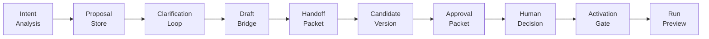

# ERPGuard — Architecture Reference

> **Status**: As-implemented. Auto-generated from Serena memories + code inspection.
> **Last updated**: 2026-05-28 (Sprint 55)
> **Source of truth**: Code. This document describes what exists, not what is planned.

---

## 1. Purpose

ERPGuard is a **semantic safety layer for ERP operations**. It sits between actors (human operators, AI agents, scheduled jobs) and ERP systems (Odoo first, others later) to **evaluate, approve, and audit** every write operation before it reaches the ERP. The system does **not** execute uncontrolled ERP writes — it provides evidence, preflight decisions, and audit trails. Two gated pilot write paths exist (R1 `mail.message.create` and R2 `res.partner.write` on `comment`/`website` fields only) that are allowlist-restricted and require explicit approval.

---

## 2. Design Principles

| Principle | Meaning |
|-----------|---------|
| **Fail closed** | If state, mapping, permissions, or policy evaluation cannot be understood, return `unsupported`, `needs_more_context`, or `block` |
| **Pre-action first** | All value is in evaluating before execution, not during or after |
| **Canonical boundary** | Adapters translate native ERP data into canonical objects before policies run |
| **Evidence-based decisions** | Every decision includes invariant results, evidence, risk level, and summary |
| **Advisory by default** | `can_execute=False`, `is_advisory_only=True`, `will_execute=False` on all advisory endpoints |
| **Explicit activation required** | No automatic execution, scheduling, or approval — every upgrade requires a human decision and audit trail |

---

## 3. System Layers

```
┌─────────────────────────────────────────────────────────┐
│                    /demo Dashboard                       │
│           (HTML+JS monolith, ~15 sections)               │
├─────────────────────────────────────────────────────────┤
│                    API Layer (FastAPI)                    │
│           ~55 routers, /v1/* endpoints                   │
│           apps/api/routes/*.py, apps/api/schemas/*.py     │
├─────────────────────────────────────────────────────────┤
│                  Product Services Layer                   │
│           ~241 modules in erpguard/product/*.py           │
│           Domain logic, validation, orchestration         │
├─────────────────────────────────────────────────────────┤
│              Core Engine Layer                            │
│  erpguard/core/preflight.py — Preflight engine            │
│  erpguard/core/risk_engine.py — Risk classification       │
│  erpguard/policies/ — YAML policy engine                  │
│  erpguard/invariants/ — Formula guard invariant            │
│  erpguard/canonical/ — Domain objects, actions, enums     │
├─────────────────────────────────────────────────────────┤
│                  Adapter Layer                            │
│  erpguard/adapters/base.py — ERPAdapter contract          │
│  erpguard/adapters/factory.py — Adapter factory            │
│  erpguard/adapters/fake.py — Fake adapter for demo         │
│  erpguard/adapters/odoo/ — Read-only Odoo adapter          │
├─────────────────────────────────────────────────────────┤
│                 Persistence Layer                         │
│  erpguard/db/models.py — ~110 model classes               │
│  erpguard/db/repositories.py — ~290 repo functions         │
│  erpguard/db/session.py — SQLAlchemy NullPool sessions    │
│  SQLite (dev/test), PostgreSQL-compatible schema           │
└─────────────────────────────────────────────────────────┘
```

---

## 4. Functional Domains

The product layer is organized by Sprint-delivered domains. Each domain follows a consistent pattern: product services → API routes → schemas → DB models → tests → demo section.

### 4.1 Core Preflow (Sprints 1-7)

| Domain | Key files | Purpose |
|--------|-----------|---------|
| Connections | `connections.py`, `product.py` | Manage ERP connections |
| Odoo Read-Only | `adapters/odoo/readonly_client.py`, `adapters/odoo/diagnosis.py` | Read-only Odoo adapter with write pilot paths |
| Preflight | `core/preflight.py`, `routes/preflight.py` | Evaluate ERP actions before execution |
| Risk Engine | `core/risk_engine.py` | Classify actions by risk level (R0-R5) |
| Policy Engine | `policies/engine.py`, `policies/loader.py` | Load and evaluate YAML policies |
| Formula Guard | `invariants/formula.py` | Validate formula consistency in sales order lines |
| Canonical Model | `canonical/objects.py`, `canonical/actions.py`, `canonical/enums.py` | Stable domain objects (Company, Customer, Product, SalesOrder, SalesOrderLine) |

### 4.2 Skill Lifecycle (Sprints 3-7)

| Domain | Key files | Purpose |
|--------|-----------|---------|
| Skill Registry | `product/skill_*.py` (6 files) | Register, version, activate, and deactivate skills |
| Skill Run | `product/active_skill_runner.py`, `product/active_skill_run_*.py` | Execute skills against Fake ERP |
| Skill Schedule | `product/skill_schedule*.py` (4 files) | Schedule and tick skill execution |
| Skill Compilation | `compiler/recording_to_skill.py` | Compile recordings into skill packages |

### 4.3 Recording & Demo (Sprints 8-13)

| Domain | Key files | Purpose |
|--------|-----------|---------|
| Recording Session | `product/recording_api.py`, `routes/recordings.py` | Capture operator actions as structured events |
| Browser Recorder | `recorder/browser_recorder.py` | Record browser interactions with Fake ERP |
| Browser Runtime | `runtime/browser_runtime.py` | Playwright-driven execution against Fake ERP |
| Demo Dashboard | `routes/demo_dashboard.py` | Single-page HTML+JS with ~80 buttons across ~15 sections |
| Demo Orchestrator | `demo/full_flow.py` | End-to-end demo: record → compile → run → evidence |

### 4.4 Operator Safety & Audit (Sprints 20-27)

| Domain | Key files | Purpose |
|--------|-----------|---------|
| Operator Evidence | `product/operator_evidence_pack.py`, `product/operator_safety_report.py` | Assemble evidence packs for human review |
| Operator Runbook | `product/operator_runbook_summary.py` | Document operations and safety boundaries |
| Release Readiness | `routes/release.py`, `scripts/check_release_install.py` | Health, readiness, safety boundaries endpoints |

### 4.5 Agent Advisory Pipeline (Sprints 28-41)

This is the largest domain group, spanning 14 sprints. It implements a **gated advisory pipeline** where an AI agent can propose, clarify, review, version, approve, and activate automations — but never execute them directly.



| Phase | Sprint | Key modules | Purpose |
|-------|--------|-------------|---------|
| Intent & Proposal | 28 | `agent_intent_analyzer.py`, `agent_proposal_store.py` | Classify operator intent, generate advisory proposals |
| Clarification | 30 | `agent_clarification_*.py` (6 files) | Answer questions, confirm mappings, track completeness |
| Draft Bridge | 31 | `agent_draft_bridge_*.py` (7 files) | Bridge advisory drafts to ERPGuard review pipeline |
| Handoff | 32 | `agent_draft_handoff_*.py` (5 files) | Generate approval-ready handoff packets |
| Versioning | 34 | `agent_handoff_*.py` (6 files) | Create candidate versions from handoff packets |
| Approval | 35 | `agent_candidate_approval_*.py` (6 files) | Generate approval packets for human decision |
| Decision | 36 | `agent_candidate_decision_*.py` (6 files) | Record human approve/reject/request_changes |
| Activation | 37-38 | `agent_candidate_activation_*.py` (10 files) | Request and perform explicit activation |
| Run Preview | 39 | `agent_skill_run_preview_*.py` (5 files) | Preview execution readiness without running |

### 4.6 Operator Action Dispatch (Sprints 42-46)

| Domain | Key files | Purpose |
|--------|-----------|---------|
| Action Planner | `product/operator_action_plan_*.py` (5 files) | Generate ordered action plans from natural language |
| Step Tokens | `product/operator_step_preview.py`, `operator_step_confirmation.py` | Time-limited confirmation tokens for plan steps |
| Action Registry | `product/operator_action_registry.py` | Allowlisted action keys with safety tiers |
| Dispatch Policy | `product/operator_action_dispatch_policy.py` | Evaluate dispatch eligibility per safety tier |
| Dispatch Execute | `product/operator_action_dispatcher.py`, `operator_action_dispatch_handlers.py` | Execute allowlisted read-only handlers after confirmed token |

### 4.7 Controlled Execution (Sprints 47-50)

| Domain | Key files | Purpose |
|--------|-----------|---------|
| Manual Dry Run | `product/manual_dry_run_*.py` (4 files) | Simulated execution with gate checks, no real ERP |
| Fake ERP Execution | `product/fake_erp_execution_*.py` (5 files) | Controlled execution against Fake ERP only |
| Fake ERP Evidence | `product/fake_erp_evidence_pack.py` | Persisted evidence pack from completed executions |
| Fake ERP Regression | `product/fake_erp_regression_*.py` (3 files) | Deterministic regression cases against Fake ERP |

### 4.8 ERP Adapter Contract (Sprints 51-54)

| Domain | Key files | Purpose |
|--------|-----------|---------|
| Adapter Contract | `product/erp_adapter_contract.py` | Neutral interface any ERP adapter must implement |
| Capability Registry | `product/erp_adapter_capability_registry.py` | Declare what capabilities each ERP has |
| Safety Policy | `product/erp_adapter_safety_policy.py` | Decide eligibility, preview, block, or not-yet-executable |
| Connector Setup | `product/connector_setup_session.py`, `connector_setup_audit.py` | Onboard ERP connections with URL validation |

### 4.9 Connector & Marketplace (Sprints 15, 17-19)

| Domain | Key files | Purpose |
|--------|-----------|---------|
| Connector Catalog | `product/connector_catalog.py` | Internal catalog of available connectors |
| Skill Template Catalog | `product/skill_template_catalog.py` | Installable skill templates |
| Template Installer | `product/template_installer.py` | Install templates as automation drafts |
| Marketplace API | `routes/marketplace.py` | Browse connectors, templates, requirements |
| Credential Vault (Sprint 17) | `product/credential_vault.py`, `connector_auth_profile.py` | Store vault references and SHA-256 fingerprints only |
| Connector Credential Vault (Sprint 55) | `product/connector_credential_vault.py` | Seal credentials into vault references with redaction and audit |
| Google Calendar OAuth (Sprint 19) | `product/google_calendar_oauth.py`, `google_calendar_readonly_client.py` | Placeholder OAuth flow for calendar read-only |

---

## 5. Data Model Overview

All persistence uses SQLAlchemy with a single models file and a single repositories file.

### 5.1 ID Prefix Convention

Every model uses a short prefix for its primary key and table name:

| Prefix | Domain | Example Models |
|--------|--------|----------------|
| `conn_` | Connections | Connection |
| `pf_` | Preflight | PreflightCase, InvariantResult, AuditEvent |
| `sk_` | Skills | Skill, SkillVersion, SkillRun, SkillRunStep |
| `rec_` | Recordings | RecordingSession, RecordingEvent |
| `dr_` | Automation Drafts | AutomationDraft, AutomationDraftReview |
| `abs_` | Agent Builder | AgentBuilderSession, AgentBuilderEvent |
| `adv_` | Advisory | AdvisorySession, AdvisoryProposal |
| `ocl_` | Operator Console | OperatorConsoleSession, OperatorConsoleQuery |
| `oap_` | Action Plans | OperatorActionPlanEvent, ActionPlanStepToken |
| `adl_` | Action Dispatch | ActionDispatchEligibilityEvent, ActionDispatchResultRecord |
| `mdb_` | Manual Dry Run | ManualDryRunEvidence, ManualDryRunAuditEvent |
| `fexec_` | Fake ERP Execution | FakeERPExecutionRecord, FakeERPExecutionEvidence |
| `freg_` | Fake ERP Regression | FakeERPRegressionCase, FakeERPRegressionRun |
| `credv_` | Credential Vault | CredentialVaultEntry, CredentialVaultAuditEvent |

### 5.2 Model Count

~110 model classes in `erpguard/db/models.py`, ~290 repository functions in `erpguard/db/repositories.py`.

---

## 6. API Surface

The FastAPI app registers **~55 routers** in `apps/api/main.py` (including Sprint 55 credential vault routes).

### 6.1 API Prefix Pattern

All business endpoints use `/v1/<domain>/...`:

| Prefix | Domain | Sprint |
|--------|--------|--------|
| `/v1/preflight` | Preflight evaluation | 1 |
| `/v1/connections` | ERP connections | 1 |
| `/v1/skills` | Skill registry, run, versioning | 3-7 |
| `/v1/recordings` | Recording sessions and events | 8 |
| `/v1/operator/evidence-packs` | Operator evidence | 26 |
| `/v1/agent-builder/advisory/*` | Advisory pipeline | 28-41 |
| `/v1/agent-builder/discovery/*` | Semantic skill discovery | 40 |
| `/v1/operator/console/*` | Conversational console | 41-42 |
| `/v1/operator-console/action-plan/*` | Action dispatch | 43-46 |
| `/v1/v1/manual-dry-run/*` | Manual dry run | 47 |
| `/v1/fake-erp-execution/*` | Controlled Fake ERP | 48 |
| `/v1/v1/erp-adapter-capability/*` | ERP adapter | 51-53 |
| `/v1/connectors/setup/*` | Connector setup | 54 |

### 6.2 Special Endpoints

| Endpoint | Purpose |
|----------|---------|
| `GET /demo` | Interactive HTML dashboard with ~80 buttons |
| `GET /v1/release/health` | Health check |
| `GET /v1/release/readiness-report` | Release readiness |
| `GET /v1/release/safety-boundaries` | Safety boundary audit |

---

## 7. Safety Invariants

These invariants are enforced across the entire codebase:

1. **No uncontrolled ERP writes** — Two gated pilot write paths exist (R1 `mail.message.create` via `pilot_write_client.py` and R2 `res.partner.write` on `comment`/`website` via `r2_write_client.py`), both allowlist-restricted and requiring explicit approval. All other ERP writes are blocked.
2. **No MCP execution gateway** — No arbitrary tool execution protocol
3. **No LLM runtime replay** — No autonomous agent execution
4. **No browser automation beyond Fake ERP** — Playwright only for the demo surface
5. **`can_execute=False`** on all advisory endpoints
6. **`is_advisory_only=True`** on all advisory endpoints
7. **`will_execute=False`** on all advisory endpoints
8. **Fake ERP execution (Sprints 48-50)** is the only real execution path beyond R1/R2 pilot writes, gated by Sprint 47 manual dry-run completion
9. **Every Sprint** explicitly lists what was NOT added in the AGENTS.md no-goals section

---

## 8. Risk Classification

The central risk engine (`erpguard/core/risk_engine.py`) classifies every canonical ERP action. Derived from code inspection and AGENTS.md:

| Level | Meaning | Decision |
|-------|---------|----------|
| R0 | Informational | Allow |
| R1 | Low risk | Allow |
| R2 | Moderate risk | Allow with warning |
| R3 | High risk | **Require approval** |
| R4 | Critical risk | **Require approval** |
| R5 | Prohibited | Block |

---

## 9. Sprint Progression

The project has grown through 55 sprints (derived from AGENTS.md), each adding a controlled functional increment:

| Sprints | Theme | Key Addition |
|---------|-------|-------------|
| 1-7 | Core foundation | Preflight, policies, Skill Registry, Formula Guard |
| 8-13 | Recording & Demo | Browser recorder, compiler, Teach Mode, Skill Inspector |
| 14-19 | Deployment & Connectors | Release validation, VPS deployment, Skill Marketplace, Credentials |
| 20-27 | Operator Audit | Evidence packs, safety reports, runbooks, demo rehearsal |
| 28-32 | Agent Advisory | Intent analysis, proposals, clarification, draft bridge, handoff |
| 33-38 | Agent Governance | Versioning, approval, human decision, activation gate |
| 39-41 | Semantic & Console | Run preview, skill discovery, operator console |
| 42-46 | Action Dispatch | Action plans, confirmation tokens, read-only dispatch |
| 47-50 | Controlled Execution | Manual dry-run, Fake ERP execution, evidence, regression |
| 51-53 | ERP Agnostic | Adapter contract, capability registry, safety policy |
| 54-55 | Connector Setup & Credentials | Setup sessions, credential vault contract |

---

## 10. Tech Stack

| Component | Technology | Version |
|-----------|-----------|---------|
| Language | Python | 3.13+ |
| Web Framework | FastAPI | 0.115+ |
| ORM | SQLAlchemy | 2.x |
| Validation | Pydantic | 2.x |
| Browser Automation | Playwright | 1.0+ |
| Database (dev/test) | SQLite | (via SQLAlchemy) |
| Database (production target) | PostgreSQL | Compatible schema |
| Package Management | pip + pyproject.toml | setuptools |
| Test Framework | pytest | 9.x |

---

## 11. Test Architecture

- **332 test files**, **~2400 test cases**
- One test file per product module: `test_<module>.py`
- Sprint pattern: product tests + API tests + UI tests + docs contract tests
- Test runner: `python -m pytest -q`
- SQLite in-memory with NullPool for test isolation
- Browser-dependent tests skip gracefully when Chromium unavailable

---

## 12. Key Files

| File | Purpose |
|------|---------|
| `erpguard/db/models.py` | ~110 SQLAlchemy model classes — single source of truth |
| `erpguard/db/repositories.py` | ~290 repository functions |
| `erpguard/db/session.py` | SQLAlchemy session management with NullPool |
| `apps/api/main.py` | FastAPI app entry point, ~53 router registrations |
| `erpguard/core/risk_engine.py` | Central risk classification (R0-R5) |
| `erpguard/core/preflight.py` | Preflow orchestration engine |
| `erpguard/policies/engine.py` | YAML policy evaluation |
| `erpguard/canonical/actions.py` | Canonical action definitions |
| `erpguard/canonical/objects.py` | Canonical domain objects |
| `erpguard/adapters/base.py` | ERP adapter contract interface |
| `erpguard/adapters/factory.py` | Adapter selection by connection type |
| `erpguard/adapters/fake.py` | Fake adapter for demo and testing |
| `erpguard/adapters/odoo/` | Real Odoo read-only adapter (XML-RPC) |
| `apps/api/routes/demo_dashboard.py` | Monolithic demo HTML+JS |
| `erpguard/config.py` | Settings and configuration |
| `AGENTS.md` | Agent work log with sprint-by-sprint changes |
| `pyproject.toml` | Project metadata and build configuration |

---

## 13. Architecture Decisions

| Decision | Rationale |
|----------|-----------|
| Single models.py file | All DB models in one place for discoverability; Sprint-by-Sprint additions are additive |
| Single repositories.py file | All data access in one place; mirrors models.py structure |
| Product service pattern | One class per file, no inheritance hierarchies; keeps Sprint additions isolated |
| YAML policies | Deterministic, auditable, no LLM dependency for policy evaluation |
| Prefixed string IDs | Domain prefixes (conn_, sk_, rec_, etc.) make IDs self-describing and prevent cross-domain collisions |
| NullPool for SQLite | Eliminates database-is-locked errors in test suites |
| Monolithic demo dashboard | Rapid iteration for demo; not a production UI |
| Advisory-only by default | `can_execute=False` on all new endpoints; real execution requires explicit Sprint-level approval |
| Fake ERP as execution boundary | Only Sprint 48 adds real execution, and only against Fake ERP; R1/R2 pilot writes are the only real Odoo paths, both gated |

---

## 14. What This Document Does NOT Cover

- **Future plans**: See `docs/specs/` for forward-looking specifications
- **Sprint-by-sprint changes**: See `AGENTS.md` for the detailed work log
- **API request/response schemas**: See `apps/api/schemas/` for Pydantic models
- **Deployment procedures**: See `docs/deployment/` and `docs/release/`
- **Demo scenarios**: See `docs/demo/` for evidence JSON snapshots