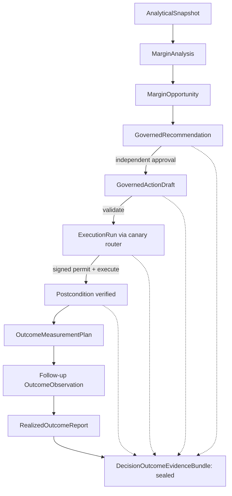
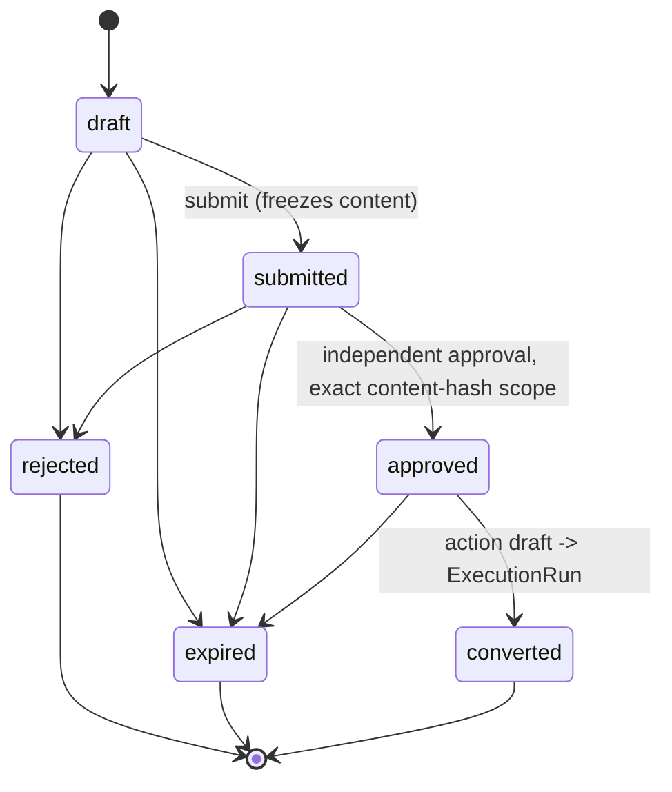
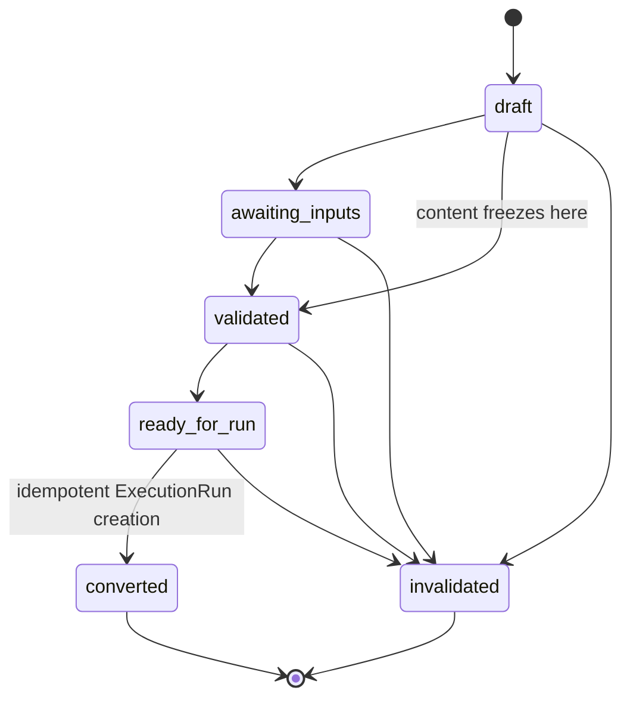
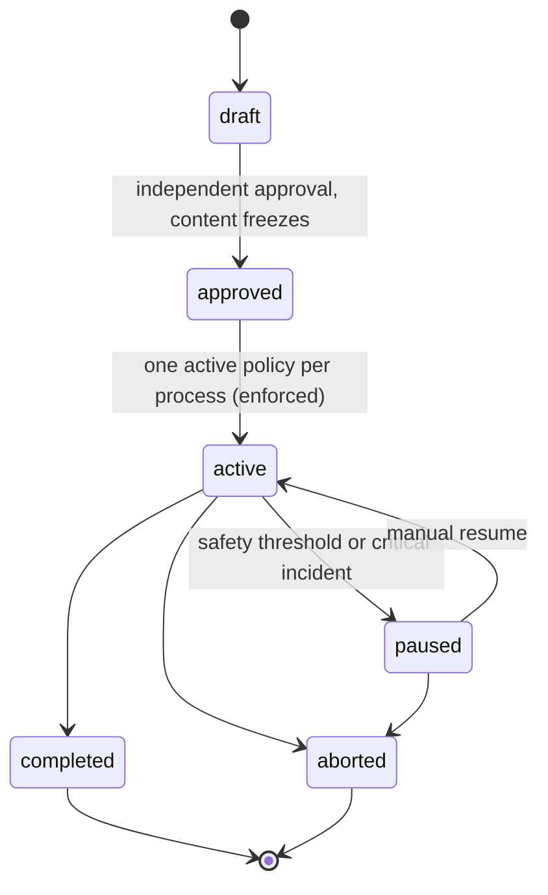
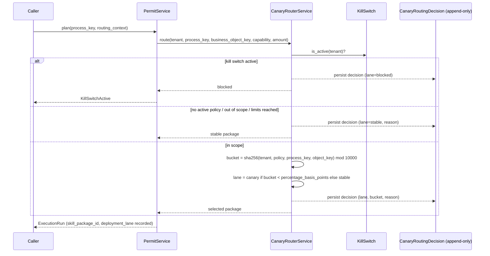
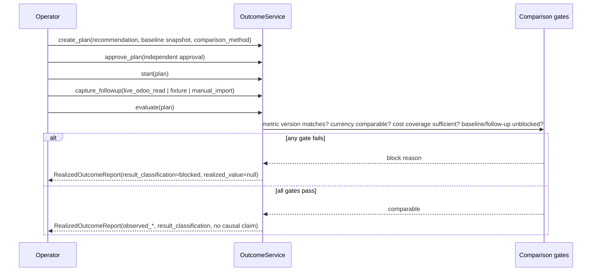
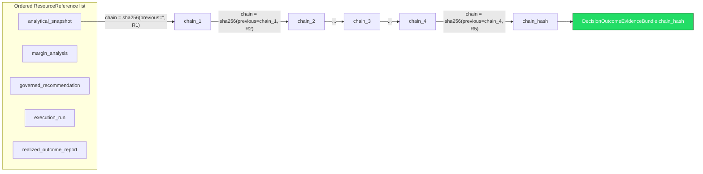
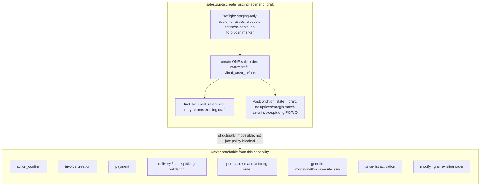

# Decision-to-Outcome Flow (Spec 92)

Diagrams for the governed decision-to-outcome lifecycle added in
`docs/specs/92_governed_decision_to_outcome_backend_rc.md`. Each diagram
names the actual model/service that implements it — none of this is
aspirational.

## 1. Decision-to-outcome lifecycle

## 2. Recommendation state machine

## 3. Action-draft state machine

## 4. Canary policy state machine

## 5. Canary routing sequence

## 6. Outcome measurement sequence

## 7. Evidence hash chain

Any change to `R1`..`R4` invalidates `chain_hash` even if `R5` and the
final link are untouched — the chain, not just each individual hash, is
what `verify()` and the sealed-immutability listener protect.

## 8. Odoo pricing-scenario capability boundary

`OdooConnectorPlugin` has no `model`, `method`, or `execute_raw` attribute
at all (`tests/test_phase16_7_pricing_scenario_draft.py::test_no_generic_write_method_exists`
and the identical check in `test_backend_rc_end_to_end.py` assert this
structurally, not just by convention).
