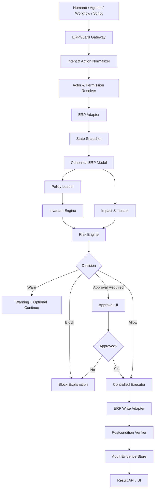

# ERPGuard Universal — Documento Padre para Spec-Driven Development

**Estado:** Documento padre / fuente de verdad del producto  
**Versión:** 0.1  
**Fecha:** Mayo 2026  
**Producto:** ERPGuard  
**Subproducto inicial:** ERPGuard for Odoo  
**Categoría propuesta:** ERP Semantic Safety Layer / ERP Safety Kernel  
**Objetivo:** Construir una capa universal de verificación, simulación, autorización, ejecución controlada y auditoría para ERPs, empezando por Odoo.

---

# 1. Resumen ejecutivo

ERPGuard es una capa de seguridad semántica para ERPs. Su función es impedir que humanos, automatizaciones o agentes de IA ejecuten acciones críticas directamente sobre un ERP sin antes comprobar su impacto real.

ERPGuard no es un chatbot, no es un workflow builder, no es un RPA y no es otro agente para Odoo. Es un **kernel semántico de seguridad operativa** situado entre cualquier actor operativo y el ERP.

La idea central:

> Antes de confirmar, fabricar, importar, facturar, validar, reservar, modificar permisos o ejecutar una acción crítica en un ERP, ERPGuard simula el impacto, verifica reglas de negocio, clasifica riesgo, solicita aprobación si procede, ejecuta de forma controlada y deja evidencia auditable.

El primer producto será **ERPGuard for Odoo**, porque Odoo combina ventas, compras, CRM, fabricación, stock, contabilidad, reglas de acceso, Studio, campos personalizados y acciones automatizadas en un sistema suficientemente abierto para construir un MVP real.

La visión universal es crear un modelo canónico de procesos ERP y un SDK de adaptadores para llevar ERPGuard después a ERPNext, Microsoft Dynamics, SAP, NetSuite, Sage, Oracle Fusion, Holded, Zoho y otros sistemas.

---

# 2. Tesis del producto

## 2.1 Tesis principal

Los ERPs son sistemas de efectos encadenados. Una acción aparentemente simple puede producir consecuencias en inventario, fabricación, compras, contabilidad, permisos, facturación, trazabilidad o automatizaciones secundarias.

Con la llegada de agentes de IA y automatizaciones cada vez más autónomas, el riesgo aumenta: habrá más sistemas intentando operar sobre ERPs sin comprender completamente sus invariantes semánticos.

ERPGuard propone una nueva arquitectura:

> Ningún humano, agente o automatización debería ejecutar acciones críticas directamente contra un ERP. Toda acción crítica debería pasar por una capa de preflight semántico.

## 2.2 Tesis técnica

Es posible construir una capa independiente que:

1. Lea el estado real del ERP.
2. Traduzca objetos nativos a un modelo canónico.
3. Evalúe políticas semánticas.
4. Simule impacto operativo.
5. Clasifique riesgo.
6. Bloquee, advierta o solicite aprobación.
7. Ejecute acciones autorizadas.
8. Verifique postcondiciones.
9. Genere evidencia auditable.
10. Use IA solo para diagnóstico, explicación, generación asistida de reglas y mapeo, no como ejecutor libre.

## 2.3 Tesis comercial

Las empresas no compran “agentes revolucionarios”. Compran reducción de errores, control, trazabilidad, cumplimiento, ahorro de tiempo y menor dependencia de desarrolladores.

ERPGuard se vende como:

> Una capa de seguridad y auditoría para procesos críticos de ERP.

No como:

> Una IA que hace cosas en Odoo.

---

# 3. Qué problema resuelve

## 3.1 Problemas reales en ERP

En un ERP, las acciones críticas suelen tener efectos secundarios:

- Confirmar un pedido puede crear entregas, compras, fabricaciones, reservas de stock y movimientos de inventario.
- Validar una fabricación puede consumir lotes equivocados.
- Importar un Excel mal mapeado puede crear productos duplicados, saldos descuadrados o relaciones rotas.
- Cambiar una regla de registro puede ocultar documentos a usuarios concretos.
- Una acción automatizada puede mover oportunidades a etapas incorrectas.
- Un campo Studio renombrado puede romper código, automatizaciones y validaciones.
- Una factura publicada incorrectamente puede crear problemas contables.
- Un agente de IA con permisos de escritura puede ejecutar acciones aparentemente correctas pero semánticamente inválidas.

## 3.2 Problema actual

Las herramientas actuales suelen operar en uno de estos extremos:

1. Automatizan sin entender suficiente semántica ERP.
2. Auditan después de que el daño ya ocurrió.
3. Dependen del conocimiento del consultor.
4. Están encerradas en un ERP concreto.
5. Tienen permisos técnicos, pero no validaciones semánticas de negocio.
6. Permiten que agentes hagan tool-calling sin un modelo profundo de impacto operativo.

## 3.3 Solución propuesta

ERPGuard introduce un ciclo obligatorio para acciones críticas:

1. Capturar intención.
2. Identificar actor.
3. Leer estado actual.
4. Traducir a modelo canónico.
5. Evaluar reglas.
6. Simular impacto.
7. Clasificar riesgo.
8. Decidir: permitir, advertir, pedir aprobación o bloquear.
9. Ejecutar solo si está autorizado.
10. Verificar estado posterior.
11. Registrar evidencia completa.

---

# 4. Competencia y diferenciación

## 4.1 Categorías existentes

ERPGuard tiene competencia adyacente, pero no debe posicionarse como un clon de ninguna de estas categorías:

1. **RPA:** UiPath, Power Automate, Automation Anywhere.
2. **Workflow automation:** n8n, Make, Zapier, Workato.
3. **BPM:** Camunda, Flowable, Pega.
4. **Process mining:** Celonis, SAP Signavio.
5. **ERP-native automation:** Odoo Automated Actions, SAP workflows, Dynamics Power Platform.
6. **AI ERP assistants:** SAP Joule, Microsoft Copilot for Dynamics, NetSuite AI, ServiceNow AI Agents.
7. **Agent frameworks:** LangGraph, CrewAI, AutoGen, Google ADK.
8. **Agent verification research:** AgentSPEX, Agentproof, authenticated workflows, policy runtimes for agents.

## 4.2 Diferenciación

ERPGuard no compite diciendo “hago workflows”. Compite diciendo:

> Verifico si un workflow, humano o agente debería poder tocar el ERP.

Diferencia por categoría:

### Frente a n8n / Zapier / Make

Ellos automatizan integraciones.

ERPGuard verifica consecuencias semánticas antes de permitir acciones críticas.

### Frente a RPA

RPA imita clics o acciones humanas.

ERPGuard valida si esas acciones son seguras según reglas de ERP, stock, contabilidad, permisos y negocio.

### Frente a BPM

BPM modela procesos.

ERPGuard inspecciona el estado real del ERP y decide si el siguiente paso es seguro.

### Frente a process mining

Process mining analiza procesos pasados.

ERPGuard previene fallos futuros antes de ejecutar.

### Frente a asistentes nativos de ERP

Los asistentes nativos son vendor-specific.

ERPGuard aspira a ser vendor-neutral mediante modelo canónico y adaptadores.

### Frente a frameworks de agentes

Los frameworks de agentes orquestan tool calls.

ERPGuard gobierna si esos tool calls pueden ejecutarse contra un ERP.

---

# 5. Principios no negociables

## 5.1 Fail-closed

Si ERPGuard no entiende el estado, no ejecuta acciones críticas.

## 5.2 Pre-action first

El valor principal está antes de ejecutar, no después.

## 5.3 Semántica antes que automatización

No basta con saber llamar a `action_confirm`. Hay que saber qué significa confirmar un pedido en ese contexto.

## 5.4 Vendor-neutral by design

Aunque Odoo sea el primer ERP, la arquitectura debe estar preparada para otros.

## 5.5 Evidence-based decisions

Cada bloqueo, advertencia o aprobación debe estar respaldado por evidencia concreta.

## 5.6 IA controlada

La IA ayuda a explicar, mapear, diagnosticar y proponer reglas, pero no puede saltarse el kernel.

## 5.7 Human approval for critical actions

Facturación, pagos, fabricación final, validación de albaranes, borrados masivos y cambios de permisos requieren aprobación humana o administrativa.

## 5.8 Auditabilidad completa

Cada decisión debe poder reconstruirse: quién pidió qué, en qué estado, qué se simuló, qué se verificó, qué decisión se tomó y qué se ejecutó.

---

# 6. Definiciones

**ERP:** sistema de gestión empresarial: Odoo, SAP, Dynamics, NetSuite, ERPNext, Sage, Oracle Fusion, etc.

**Actor:** humano, agente IA, workflow, script, módulo, webhook o integración que solicita una acción.

**Acción crítica:** operación con impacto operativo, financiero, contable, de stock, permisos o trazabilidad.

**Preflight:** análisis previo a la ejecución de una acción.

**Modelo canónico:** representación común de objetos ERP independiente del proveedor.

**Adaptador ERP:** componente que traduce entre el ERP nativo y el modelo canónico.

**Política semántica:** regla declarativa que define precondiciones, simulaciones, riesgos y postcondiciones.

**Invariante:** condición que debe mantenerse para que el proceso sea válido.

**Simulación de impacto:** predicción de efectos que producirá la acción.

**Risk engine:** motor que clasifica riesgo y decide política de aprobación.

**Controlled executor:** ejecutor que realiza acciones autorizadas y verificadas.

**Audit evidence:** expediente completo de decisión y ejecución.

---

# 7. Arquitectura general



---

# 8. Módulos principales

## 8.1 ERPGuard Gateway

Punto de entrada de todas las solicitudes.

### Responsabilidades

- Recibir acciones.
- Normalizar payloads.
- Identificar actor.
- Detectar riesgo preliminar.
- Crear caso de preflight.
- Enviar a motor de políticas.
- Devolver decisión.

### Entradas soportadas

- API REST.
- Webhook.
- UI web.
- Módulo Odoo.
- CLI.
- Agente IA.
- Automatización externa.

---

## 8.2 Intent & Action Normalizer

Convierte solicitudes nativas o lenguaje natural en acciones canónicas.

Ejemplo:

```json
{
  "native": {
    "erp": "odoo",
    "model": "sale.order",
    "method": "action_confirm",
    "record_id": 40
  },
  "canonical": {
    "object": "SalesOrder",
    "action": "confirm_sales_order",
    "target_id": "40"
  }
}
```

### Requisitos

- No debe depender únicamente de IA.
- Debe tener mapeos deterministas.
- La IA solo puede ayudar cuando el mapeo sea ambiguo.
- Toda inferencia IA debe quedar marcada como inferida.

---

## 8.3 Actor & Permission Resolver

Determina quién solicita la acción y con qué permisos.

### Actores

- Usuario ERP.
- Usuario externo.
- Servicio técnico.
- Agente IA.
- Workflow n8n/Make/Zapier.
- Script interno.
- Módulo Odoo.

### Debe calcular

- identidad;
- rol;
- permisos nativos;
- permisos ERPGuard;
- scope;
- acciones permitidas;
- necesidad de aprobación.

---

## 8.4 ERP Adapter Layer

Capa de integración con ERPs.

### Contrato mínimo del adaptador

```yaml
adapter_contract:
  metadata:
    erp_type: string
    erp_version: string
    capabilities: list

  schema:
    inspect_objects: function
    inspect_fields: function
    inspect_permissions: function

  read:
    get_object: function
    search_objects: function
    get_related_objects: function

  simulate:
    simulate_action: optional_function
    infer_impact: function

  execute:
    execute_action: function
    supports_transaction: boolean
    supports_rollback: boolean

  audit:
    get_native_audit: optional_function
```

### Primer adaptador

`OdooAdapter`.

### Segundo adaptador recomendado

`ERPNextAdapter`, porque ERPNext es open source y permite probar universalidad sin depender de SAP o Dynamics.

---

## 8.5 Canonical ERP Model

Modelo común que abstrae objetos de ERP.

### Objetos versión 0.1

1. Company.
2. User.
3. Customer.
4. Supplier.
5. Product.
6. SalesOrder.
7. SalesOrderLine.
8. InventoryMove.
9. LotSerial.
10. Invoice.

### Objetos versión 0.2

11. PurchaseOrder.
12. ManufacturingOrder.
13. BillOfMaterials.
14. WorkOrder.
15. JournalEntry.
16. Payment.
17. AccessRule.
18. AutomatedAction.
19. Warehouse.
20. StockLocation.

---

# 9. Modelo canónico detallado

## 9.1 SalesOrder

```yaml
SalesOrder:
  id: string
  native_id: string
  reference: string
  company: Company
  customer: Customer
  state: enum[draft, sent, confirmed, done, cancelled, unknown]
  order_date: datetime
  currency: string
  total_amount: decimal
  untaxed_amount: decimal
  tax_amount: decimal
  lines: list[SalesOrderLine]
  invoice_policy: enum[ordered, delivered, milestone, unknown]
  warehouse: Warehouse
  native_metadata: object
```

## 9.2 SalesOrderLine

```yaml
SalesOrderLine:
  id: string
  native_id: string
  product: Product
  quantity: decimal
  uom: string
  unit_price: decimal
  subtotal: decimal
  tax_ids: list[string]
  route_policy: enum[stock, make_to_order, manufacture, dropship, unknown]
  custom_attributes: object
```

## 9.3 Product

```yaml
Product:
  id: string
  native_id: string
  sku: string
  name: string
  active: boolean
  type: enum[stockable, consumable, service, digital, unknown]
  tracking: enum[none, lot, serial]
  category: string
  cost: decimal
  sale_price: decimal
  uom: string
  routes: list[string]
  bom_ids: list[string]
  custom_attributes: object
```

## 9.4 InventoryMove

```yaml
InventoryMove:
  id: string
  product: Product
  quantity: decimal
  source_location: string
  destination_location: string
  lot_serial: LotSerial | null
  state: enum[draft, waiting, assigned, done, cancelled, unknown]
  origin: string
```

## 9.5 ManufacturingOrder

```yaml
ManufacturingOrder:
  id: string
  product: Product
  quantity: decimal
  bom_id: string
  components: list[ComponentRequirement]
  state: enum[draft, confirmed, in_progress, done, cancelled, unknown]
  expected_lot: LotSerial | null
```

---

# 10. Política DSL

ERPGuard usa un DSL declarativo para políticas semánticas.

## 10.1 Requisitos del DSL

- Debe ser legible por humanos.
- Debe poder versionarse en Git.
- Debe poder ejecutarse determinísticamente.
- Debe separar precondiciones, simulación, reglas de riesgo y postcondiciones.
- Debe permitir extensiones por ERP y por sector.
- Debe poder explicar cada decisión.

## 10.2 Formato base

```yaml
policy: safe_confirm_sales_order
version: 1.0.0
status: active
applies_to:
  canonical_object: SalesOrder
  canonical_action: confirm_sales_order

scope:
  erps: [odoo]
  industries: [generic, manufacturing]

inputs:
  sales_order_id: string

preconditions:
  - id: customer_exists
    severity: blocking
    check: sales_order.customer.exists == true
    message: El cliente del pedido debe existir.

simulation:
  - id: inventory_impact
    simulator: simulate_inventory_reservation

risk_rules:
  - id: shortage_requires_approval
    when: simulation.inventory.has_shortage == true
    decision: require_approval
    message: Hay faltantes de stock.

postconditions:
  - id: state_confirmed
    check: sales_order.state == confirmed
    message: El pedido debe quedar confirmado.
```

## 10.3 Estados de decisión

```yaml
decisions:
  - allow
  - allow_with_warning
  - require_approval
  - block
  - unsupported
  - needs_more_context
```

---

# 11. Motor de invariantes

## 11.1 Tipos de invariantes

### Data invariants

Validan datos básicos:

- cliente existe;
- producto activo;
- impuestos configurados;
- cuenta contable existe;
- unidad de medida válida;
- producto trazable tiene lote si procede.

### Process invariants

Validan lógica de proceso:

- pedido confirmado debe tener líneas;
- fabricación no puede completarse sin componentes;
- entrega no puede validarse sin cantidades;
- factura no puede publicarse si no cuadra;
- importación no puede crear duplicados críticos.

### Permission invariants

Validan seguridad:

- usuario tiene grupo requerido;
- record rules permiten operación;
- agente no excede scope;
- acción no usa privilegios indebidos.

### Business invariants

Reglas específicas:

- fórmula de perfume suma capacidad exacta;
- FIFO por lote;
- margen mínimo;
- pedido requiere pago antes de fabricar;
- muestra no se prepara sin fórmula.

---

# 12. Simulador de impacto

## 12.1 Objetivo

Predecir consecuencias antes de ejecutar.

## 12.2 Preguntas que debe responder

- ¿Qué registros se crearán?
- ¿Qué registros se modificarán?
- ¿Qué stock se reservará?
- ¿Qué lotes se consumirán?
- ¿Qué compras se crearán?
- ¿Qué fabricaciones se crearán?
- ¿Qué facturas podrían generarse?
- ¿Qué automatizaciones secundarias se dispararán?
- ¿Qué reglas de acceso afectarán?
- ¿Qué riesgos aparecen?

## 12.3 Niveles de simulación

### Nivel A — Static inference

Lee configuración y predice.

### Nivel B — Sandbox simulation

Ejecuta en entorno de test.

### Nivel C — Native ERP simulation

Usa APIs nativas si existen.

### Nivel D — Shadow execution

Ejecuta de forma controlada y revierte si es posible.

## 12.4 MVP

El MVP usa Nivel A. Nivel B será opcional si existe una base Odoo de prueba.

---

# 13. Motor de riesgo

## 13.1 Niveles

```yaml
R0:
  name: read_only
  description: Solo lectura.
  approval: false

R1:
  name: local_output
  description: Genera archivos o informes locales.
  approval: false

R2:
  name: reversible_draft
  description: Crea borradores reversibles.
  approval: configurable

R3:
  name: operational_write
  description: Cambia procesos operativos.
  approval: required

R4:
  name: financial_or_stock_finalization
  description: Publica facturas, valida stock, finaliza fabricación.
  approval: mandatory

R5:
  name: destructive_or_security_change
  description: Borrados, cambios masivos, permisos, pagos.
  approval: admin_mandatory
  default_decision: block
```

## 13.2 Matriz inicial

| Acción | Riesgo por defecto |
|---|---|
| Leer pedido | R0 |
| Generar informe | R1 |
| Crear presupuesto borrador | R2 |
| Confirmar pedido | R3 |
| Crear compra | R3 |
| Reservar stock | R3 |
| Validar albarán | R4 |
| Marcar fabricación hecha | R4 |
| Publicar factura | R4 |
| Ejecutar pago | R5 |
| Borrar registros | R5 |
| Cambiar reglas de acceso | R5 |

---

# 14. Motor de aprobación

## 14.1 Requisito

La aprobación debe ser informada, no un simple botón.

## 14.2 Pantalla de aprobación

Debe mostrar:

- acción solicitada;
- actor;
- ERP;
- registro objetivo;
- riesgo;
- impacto previsto;
- bloqueos;
- advertencias;
- evidencia;
- recomendación;
- opción aprobar/rechazar;
- motivo de aprobación.

## 14.3 Ejemplo

```text
Acción: Confirmar pedido S00040
Actor: Agente IA
Riesgo: R3

Impacto previsto:
- 1 orden de fabricación.
- 2 compras.
- 1 entrega.
- Reserva de 12 unidades de ENVASE 100ML.

Bloqueo:
- Línea MIKADO 100 ML: fórmula 0 ml/u, capacidad requerida 100 ml/u.

Decisión recomendada: BLOQUEAR.
```

---

# 15. Ejecutor controlado

## 15.1 Funciones

- Ejecutar solo acciones aprobadas.
- Releer estado antes de ejecutar.
- Comparar estado actual contra snapshot de preflight.
- Detener si el estado cambió de forma relevante.
- Ejecutar por pasos.
- Validar postcondiciones.
- Registrar diff antes/después.

## 15.2 Idempotencia

Cada ejecución debe tener `operation_id`.

Si se reintenta, no debe duplicar registros.

## 15.3 Rollback

Si el ERP soporta transacciones, usarlas.

Si no, generar compensating actions, pero no ejecutarlas sin aprobación.

---

# 16. IA dentro de ERPGuard

## 16.1 Roles permitidos

- Explicar fallos.
- Resumir impacto.
- Traducir errores técnicos a negocio.
- Sugerir políticas.
- Sugerir invariantes.
- Mapear campos entre ERPs.
- Detectar configuraciones sospechosas.
- Proponer reparación.

## 16.2 Roles prohibidos en MVP

- Saltarse aprobación.
- Ejecutar acciones R3+ directamente.
- Crear reglas activas sin revisión.
- Publicar facturas.
- Validar stock.
- Modificar permisos.
- Borrar registros.

## 16.3 Principio

La IA nunca es autoridad final. La autoridad es el motor de políticas + aprobación humana.

---

# 17. Producto inicial: ERPGuard for Odoo

## 17.1 Objetivo

Construir el primer kernel operativo sobre Odoo 18/19.

## 17.2 Casos MVP

### Caso 1 — Safe Sales Order Preflight

Antes de confirmar pedido:

- validar cliente;
- validar líneas;
- validar productos;
- validar impuestos;
- validar fórmula si aplica;
- validar stock;
- detectar rutas;
- detectar fabricación;
- detectar compras;
- clasificar riesgo;
- explicar decisión.

### Caso 2 — Formula Guard

Especial para productos con capacidad/fórmula:

- leer líneas de venta;
- leer fórmulas custom;
- validar ml por unidad;
- validar ml total de pedido;
- detectar líneas sin fórmula;
- bloquear si no cuadra.

### Caso 3 — Import Guard

Antes de importar Excel/CSV:

- validar columnas;
- validar tipos;
- validar duplicados;
- validar relaciones;
- validar categorías;
- validar lotes;
- validar cuentas;
- generar informe.

### Caso 4 — Access Rule Guard

Diagnóstico de permisos:

- leer grupos;
- leer ACLs;
- leer record rules;
- simular visibilidad;
- explicar por qué un usuario ve/no ve un registro.

### Caso 5 — Automated Action Guard

Auditar acciones automatizadas:

- detectar opcodes prohibidos;
- detectar bucles;
- detectar cambios de etapa peligrosos;
- detectar solapamiento con otras acciones;
- detectar escrituras críticas.

---

# 18. Módulo Odoo

## 18.1 Objetivo

Crear un módulo ligero que conecte Odoo con el backend ERPGuard.

## 18.2 Funciones

- Botón “Preflight ERPGuard”.
- Botón “Confirmar seguro”.
- Smart button “Riesgos”.
- Chatter audit summary.
- Configuración de conexión.
- Webhook hacia backend.
- Bloqueo opcional de acción crítica.
- Vista de auditorías.

## 18.3 No debe contener

- Lógica IA pesada.
- Simulación compleja completa.
- Secretos de modelos LLM.
- Procesamiento multi-ERP.

Eso queda en backend externo.

---

# 19. Backend ERPGuard

## 19.1 Stack recomendado

- Python 3.11+.
- FastAPI.
- SQLAlchemy / SQLModel.
- PostgreSQL.
- Redis opcional.
- Pydantic.
- YAML policy engine.
- Docker.
- React/Vite para UI.

## 19.2 Estructura de repositorio

```text
erpguard/
  README.md
  pyproject.toml
  docker-compose.yml
  .env.example

  apps/
    api/
      main.py
      routes/
        preflight.py
        execute.py
        audit.py
        policies.py
        connections.py
        explain.py

    web/
      package.json
      src/
        pages/
        components/
        api/

  erpguard/
    core/
      gateway.py
      action_normalizer.py
      actor_resolver.py
      risk_engine.py
      approval_engine.py
      executor.py
      audit.py
      errors.py

    canonical/
      objects.py
      actions.py
      mapping.py

    adapters/
      base.py
      odoo/
        adapter.py
        mapper.py
        schema.py
        simulators.py
        permissions.py
      erpnext/
        adapter.py

    policies/
      engine.py
      loader.py
      evaluator.py
      dsl_schema.py

    invariants/
      base.py
      generic.py
      sales.py
      inventory.py
      manufacturing.py
      accounting.py
      access.py
      formula.py

    simulation/
      engine.py
      inventory.py
      manufacturing.py
      procurement.py
      accounting.py
      access.py

    llm/
      base.py
      providers.py
      prompts.py
      explainers.py
      policy_drafter.py

    db/
      models.py
      session.py
      repositories.py
      migrations/

    tests/
      test_policies.py
      test_invariants.py
      test_odoo_adapter.py
      test_preflight_sales_order.py

  policies/
    generic/
      safe_confirm_sales_order.yaml
      safe_import_products.yaml
    odoo/
      formula_guard.yaml
      access_rule_guard.yaml
      automated_action_guard.yaml
    industries/
      cosmetics_formula_pack.yaml

  examples/
    payloads/
    reports/
    datasets/

  docs/
    00_parent_spec.md
    01_architecture.md
    02_canonical_model.md
    03_policy_dsl.md
    04_odoo_adapter.md
    05_mvp_plan.md
    06_evaluation.md
```

---

# 20. API

## 20.1 Crear conexión ERP

`POST /v1/connections`

```json
{
  "name": "Odoo Esenssi Test",
  "erp_type": "odoo",
  "config": {
    "url": "https://example.odoo.com",
    "database": "example-db",
    "auth_type": "api_key"
  }
}
```

## 20.2 Preflight

`POST /v1/preflight`

```json
{
  "connection_id": "conn_001",
  "actor": {
    "type": "user",
    "native_user_id": "6",
    "display_name": "Jairo"
  },
  "action": {
    "canonical_action": "confirm_sales_order",
    "canonical_object": "SalesOrder",
    "native": {
      "model": "sale.order",
      "method": "action_confirm",
      "record_id": 40
    }
  },
  "options": {
    "simulate": true,
    "allow_write": false
  }
}
```

## 20.3 Respuesta preflight

```json
{
  "preflight_id": "pf_001",
  "decision": "block",
  "risk_level": "R3",
  "summary": "No se recomienda confirmar el pedido porque una línea no tiene fórmula válida.",
  "blocking_issues": [
    {
      "code": "formula_capacity_mismatch",
      "severity": "blocking",
      "message": "La línea MIKADO 100 ML requiere 100 ml/u y la fórmula suma 0 ml/u.",
      "evidence": {
        "line_id": 123,
        "required_capacity_ml": 100,
        "actual_formula_ml": 0
      }
    }
  ],
  "warnings": [],
  "predicted_impact": {
    "manufacturing_orders_to_create": 1,
    "purchase_orders_to_create": 2,
    "deliveries_to_create": 1
  },
  "approval_required": false
}
```

## 20.4 Execute

`POST /v1/execute`

```json
{
  "preflight_id": "pf_001",
  "approval_id": "appr_001"
}
```

## 20.5 Explain

`POST /v1/explain`

```json
{
  "case_id": "pf_001",
  "question": "Explícame por qué se bloqueó este pedido en lenguaje de negocio."
}
```

## 20.6 Audit

`GET /v1/audit/{case_id}`

---

# 21. Base de datos

## 21.1 connections

```sql
CREATE TABLE connections (
    id TEXT PRIMARY KEY,
    erp_type TEXT NOT NULL,
    name TEXT NOT NULL,
    config_json TEXT NOT NULL,
    status TEXT NOT NULL,
    created_at TIMESTAMP NOT NULL,
    updated_at TIMESTAMP NOT NULL
);
```

## 21.2 preflight_cases

```sql
CREATE TABLE preflight_cases (
    id TEXT PRIMARY KEY,
    connection_id TEXT NOT NULL,
    actor_json TEXT NOT NULL,
    action_json TEXT NOT NULL,
    canonical_action TEXT NOT NULL,
    canonical_object TEXT NOT NULL,
    state_snapshot_json TEXT NOT NULL,
    simulation_json TEXT,
    decision TEXT NOT NULL,
    risk_level TEXT NOT NULL,
    summary TEXT,
    created_at TIMESTAMP NOT NULL
);
```

## 21.3 invariant_results

```sql
CREATE TABLE invariant_results (
    id TEXT PRIMARY KEY,
    preflight_case_id TEXT NOT NULL,
    invariant_id TEXT NOT NULL,
    invariant_type TEXT NOT NULL,
    status TEXT NOT NULL,
    severity TEXT NOT NULL,
    message TEXT NOT NULL,
    evidence_json TEXT NOT NULL,
    created_at TIMESTAMP NOT NULL
);
```

## 21.4 approvals

```sql
CREATE TABLE approvals (
    id TEXT PRIMARY KEY,
    preflight_case_id TEXT NOT NULL,
    approver_actor_json TEXT NOT NULL,
    decision TEXT NOT NULL,
    reason TEXT,
    created_at TIMESTAMP NOT NULL
);
```

## 21.5 executions

```sql
CREATE TABLE executions (
    id TEXT PRIMARY KEY,
    preflight_case_id TEXT NOT NULL,
    approval_id TEXT,
    status TEXT NOT NULL,
    before_snapshot_json TEXT NOT NULL,
    after_snapshot_json TEXT,
    native_result_json TEXT,
    error_text TEXT,
    created_at TIMESTAMP NOT NULL,
    finished_at TIMESTAMP
);
```

## 21.6 audit_events

```sql
CREATE TABLE audit_events (
    id TEXT PRIMARY KEY,
    case_id TEXT NOT NULL,
    event_type TEXT NOT NULL,
    event_json TEXT NOT NULL,
    created_at TIMESTAMP NOT NULL
);
```

## 21.7 policies

```sql
CREATE TABLE policies (
    id TEXT PRIMARY KEY,
    name TEXT NOT NULL,
    version TEXT NOT NULL,
    canonical_action TEXT NOT NULL,
    canonical_object TEXT NOT NULL,
    erp_scope TEXT,
    industry_scope TEXT,
    policy_yaml TEXT NOT NULL,
    status TEXT NOT NULL,
    created_at TIMESTAMP NOT NULL,
    updated_at TIMESTAMP NOT NULL
);
```

---

# 22. Odoo Adapter

## 22.1 Funciones mínimas

```python
class OdooAdapter:
    def connect(self) -> None: ...
    def inspect_model(self, model: str) -> dict: ...
    def inspect_fields(self, model: str) -> dict: ...
    def search_read(self, model: str, domain: list, fields: list) -> list[dict]: ...
    def read(self, model: str, ids: list[int], fields: list[str]) -> list[dict]: ...
    def call_method(self, model: str, method: str, ids: list[int], args=None, kwargs=None) -> dict: ...
    def get_user_groups(self, user_id: int) -> list[dict]: ...
    def get_record_rules(self, model: str) -> list[dict]: ...
    def get_access_rights(self, model: str) -> dict: ...
```

## 22.2 Odoo models iniciales

- `sale.order`
- `sale.order.line`
- `product.product`
- `product.template`
- `stock.quant`
- `stock.move`
- `stock.picking`
- `mrp.production`
- `mrp.bom`
- `purchase.order`
- `account.move`
- `res.partner`
- `res.users`
- `res.groups`
- `ir.rule`
- `ir.model.access`
- `ir.actions.server`
- modelos custom de fórmula

---

# 23. Policies iniciales

## 23.1 safe_confirm_sales_order.yaml

```yaml
policy: safe_confirm_sales_order
version: 0.1.0
applies_to:
  canonical_object: SalesOrder
  canonical_action: confirm_sales_order

preconditions:
  - id: customer_exists
    type: data
    severity: blocking
    check: sales_order.customer.exists == true

  - id: order_has_lines
    type: process
    severity: blocking
    check: sales_order.lines.count > 0

  - id: products_are_active
    type: data
    severity: blocking
    check: all(line.product.active == true for line in sales_order.lines)

  - id: user_can_confirm
    type: permission
    severity: blocking
    check: actor.permissions.can_confirm_sales_order == true

simulation:
  - id: simulate_inventory
    simulator: inventory_impact

  - id: simulate_manufacturing
    simulator: manufacturing_impact

risk_rules:
  - id: shortage_requires_approval
    when: simulation.inventory.has_shortage == true
    decision: require_approval

  - id: creates_mo_requires_approval
    when: simulation.manufacturing.orders_to_create > 0
    decision: require_approval

postconditions:
  - id: order_confirmed
    check: sales_order.state == confirmed
```

## 23.2 formula_guard.yaml

```yaml
policy: formula_guard
version: 0.1.0
applies_to:
  canonical_object: SalesOrder
  canonical_action: confirm_sales_order

preconditions:
  - id: formula_exists_for_capacity_products
    type: business
    severity: blocking
    check: all_capacity_products_have_formula

  - id: formula_matches_capacity
    type: business
    severity: blocking
    check: formula_ml_per_unit == product_capacity_ml

  - id: total_ml_matches_quantity
    type: business
    severity: blocking
    check: formula_total_ml == formula_ml_per_unit * ordered_quantity
```

## 23.3 access_rule_guard.yaml

```yaml
policy: access_rule_guard
version: 0.1.0
applies_to:
  canonical_object: AccessRule
  canonical_action: inspect_access

checks:
  - id: global_rule_detected
    severity: warning
    check: rule.global == true

  - id: restrictive_domain_detected
    severity: warning
    check: rule.domain_limits_user_records == true

  - id: user_visibility_simulation
    severity: info
    check: simulate_user_can_read_record
```

---

# 24. Informes

## 24.1 Preflight report

Debe incluir:

- decisión;
- riesgo;
- resumen ejecutivo;
- bloqueos;
- advertencias;
- impacto previsto;
- evidencia;
- datos leídos;
- políticas aplicadas;
- actor;
- timestamp;
- recomendación.

## 24.2 Audit report

Debe incluir:

- snapshot antes;
- preflight;
- aprobación;
- ejecución;
- snapshot después;
- postcondiciones;
- errores;
- trazabilidad completa.

---

# 25. Interfaz MVP

## 25.1 Pantallas

### Dashboard

- acciones analizadas;
- bloqueos;
- advertencias;
- procesos protegidos;
- riesgos por nivel;
- últimos casos.

### Connections

- crear conexión Odoo;
- probar conexión;
- ver estado.

### Preflight

- seleccionar ERP;
- seleccionar acción;
- introducir registro;
- ejecutar análisis;
- ver decisión.

### Case detail

- resumen;
- evidencia;
- invariantes;
- simulación;
- aprobación;
- auditoría.

### Policies

- listar políticas;
- ver YAML;
- activar/desactivar;
- versionar.

---

# 26. Spec-driven development

Este documento es el documento padre. Toda implementación debe derivar de aquí.

## 26.1 Reglas de desarrollo

1. Ningún código se escribe sin referenciar una sección de esta spec.
2. Cada módulo debe tener tests.
3. Cada endpoint debe tener contrato JSON.
4. Cada política debe tener ejemplos positivos y negativos.
5. Cada acción R3+ debe pasar por risk engine.
6. Cada decisión debe generar audit event.
7. Ningún adaptador puede saltarse canonical model.
8. Ninguna función IA puede ejecutar directamente contra ERP.

## 26.2 Artefactos derivados

A partir de este documento se crearán:

1. `01_architecture.md`
2. `02_canonical_model.md`
3. `03_policy_dsl.md`
4. `04_odoo_adapter.md`
5. `05_api_contracts.md`
6. `06_database_schema.md`
7. `07_mvp_backlog.md`
8. `08_test_plan.md`
9. `09_security_model.md`
10. `10_tfm_evaluation_plan.md`

## 26.3 Definition of Ready

Una tarea está lista si tiene:

- objetivo;
- entrada;
- salida;
- módulo afectado;
- contrato;
- criterios de aceptación;
- tests esperados;
- riesgo.

## 26.4 Definition of Done

Una tarea está hecha si:

- implementa el contrato;
- tiene tests;
- genera logs;
- maneja errores;
- respeta permisos;
- actualiza documentación si cambia comportamiento;
- no rompe tests existentes.

---

# 27. MVP backlog

## Epic 1 — Project foundation

### Tarea 1.1

Crear estructura repo.

**Aceptación:** repo arranca con FastAPI y tests.

### Tarea 1.2

Configurar PostgreSQL/SQLite.

**Aceptación:** migraciones iniciales ejecutan.

### Tarea 1.3

Crear modelo `connections`.

**Aceptación:** se puede crear y listar conexión.

---

## Epic 2 — Canonical model

### Tarea 2.1

Definir Pydantic models para Company, Customer, Product, SalesOrder, SalesOrderLine.

**Aceptación:** validan ejemplos Odoo.

### Tarea 2.2

Crear canonical actions.

**Aceptación:** `confirm_sales_order` existe como acción canónica.

---

## Epic 3 — Odoo Adapter

### Tarea 3.1

Conectar a Odoo.

**Aceptación:** `version` y usuario actual devueltos.

### Tarea 3.2

Leer `sale.order`.

**Aceptación:** convierte pedido Odoo a SalesOrder canónico.

### Tarea 3.3

Leer productos y líneas.

**Aceptación:** cada línea tiene producto canónico.

### Tarea 3.4

Leer grupos, ACLs y record rules.

**Aceptación:** se puede listar seguridad de un modelo.

---

## Epic 4 — Policy engine

### Tarea 4.1

Cargar YAML policies.

**Aceptación:** policy válida carga y policy inválida falla.

### Tarea 4.2

Ejecutar preconditions.

**Aceptación:** devuelve invariant_results.

### Tarea 4.3

Aplicar risk rules.

**Aceptación:** shortage genera require_approval.

---

## Epic 5 — Formula Guard

### Tarea 5.1

Mapear campos de fórmula Odoo.

**Aceptación:** lee `x_sale_formula_line` o configuración equivalente.

### Tarea 5.2

Validar fórmula por línea.

**Aceptación:** detecta fórmula vacía, parcial y correcta.

### Tarea 5.3

Generar bloqueo explicable.

**Aceptación:** mensaje incluye producto, capacidad, fórmula actual y diferencia.

---

## Epic 6 — Preflight API

### Tarea 6.1

Crear `POST /v1/preflight`.

**Aceptación:** devuelve decision, risk_level, issues y predicted_impact.

### Tarea 6.2

Guardar preflight_case.

**Aceptación:** caso recuperable por ID.

### Tarea 6.3

Guardar invariant_results.

**Aceptación:** cada check queda persistido.

---

## Epic 7 — UI MVP

### Tarea 7.1

Pantalla conexiones.

### Tarea 7.2

Pantalla ejecutar preflight.

### Tarea 7.3

Pantalla detalle de caso.

---

## Epic 8 — Audit

### Tarea 8.1

Crear audit_events.

### Tarea 8.2

Crear `GET /v1/audit/{case_id}`.

### Tarea 8.3

Exportar informe JSON.

---

# 28. Plan de evaluación TFM

## 28.1 Pregunta de investigación

¿Puede una capa semántica de preflight para ERP detectar y prevenir errores operativos críticos antes de ejecutar acciones sobre un ERP, manteniendo trazabilidad y reduciendo tiempo de diagnóstico frente a revisión manual, scripts ad hoc y agentes LLM directos?

## 28.2 Hipótesis

H1: ERPGuard detecta errores semánticos que un validador técnico simple no detecta.

H2: ERPGuard reduce el tiempo de diagnóstico de fallos de permisos, fórmulas e importaciones.

H3: ERPGuard produce trazabilidad más completa que ejecución manual o agente directo.

H4: El modelo canónico permite reutilizar políticas parcialmente en un segundo ERP o mock ERP.

## 28.3 Baselines

1. Revisión manual.
2. Script Python ad hoc.
3. Agente LLM directo.
4. Validaciones nativas Odoo.
5. ERPGuard.

## 28.4 Experimentos

### Experimento A — Formula Guard

Dataset con pedidos correctos e incorrectos.

Medir:

- precisión;
- falsos negativos;
- tiempo de análisis;
- calidad de explicación.

### Experimento B — Import Guard

Dataset con Excels correctos e incorrectos.

Medir:

- errores detectados;
- errores no detectados;
- tiempo de corrección.

### Experimento C — Access Rule Guard

Casos de usuarios con permisos diferentes.

Medir:

- explicación correcta;
- tiempo de diagnóstico;
- comparación contra revisión manual.

### Experimento D — Universalidad

Implementar mock ERP o ERPNext parcial.

Medir:

- políticas reutilizadas;
- adaptaciones necesarias;
- objetos canónicos cubiertos.

---

# 29. Roadmap global

## Fase 0 — Diseño

- Documento padre.
- Arquitectura.
- Modelo canónico.
- Policy DSL.
- Backlog.

## Fase 1 — Odoo Preflight Core

- Backend.
- Odoo connection.
- SalesOrder mapping.
- Formula Guard.
- Preflight API.

## Fase 2 — UI + audit

- Dashboard.
- Case detail.
- Audit trail.
- Export reports.

## Fase 3 — Import Guard

- Excel/CSV validation.
- Odoo relationship validation.
- Report generation.

## Fase 4 — Access Rule Guard

- Groups.
- ACLs.
- Record rules.
- Visibility simulation.

## Fase 5 — Safe Execute

- Approval.
- Controlled executor.
- Postconditions.

## Fase 6 — Universal SDK

- Adapter contract.
- Mock ERP.
- ERPNext adapter.

## Fase 7 — Marketplace / Packs

- Domain packs.
- Industry packs.
- Policy registry.

---

# 30. Riesgos y mitigaciones

## Riesgo 1: Demasiado ambicioso

Mitigación: MVP solo Odoo, solo preflight, sin ejecución crítica inicial.

## Riesgo 2: Simulación incompleta

Mitigación: mostrar nivel de confianza de simulación y bloquear si es insuficiente.

## Riesgo 3: Falsos positivos

Mitigación: modo warning, severidades configurables, revisión humana.

## Riesgo 4: Dependencia de campos custom

Mitigación: mapeo configurable y detector de campos.

## Riesgo 5: Grandes vendors copian la idea

Mitigación: empezar en Odoo/SMB, crear packs específicos y dataset de errores reales.

## Riesgo 6: Universalidad falsa

Mitigación: crear desde el inicio mock ERP y adapter SDK, pero no prometer integración completa con todos.

---

# 31. Mensaje comercial

## Mensaje malo

“Automatiza tu Odoo con IA.”

## Mensaje bueno

“Evita que humanos, automatizaciones o agentes rompan tu ERP.”

## Mensaje premium

“ERPGuard simula, verifica y audita acciones críticas antes de que impacten en ventas, stock, fabricación, contabilidad o permisos.”

## Claim corto

**The semantic safety layer for ERP operations.**

## Claim español

**La capa de seguridad semántica para operaciones ERP.**

---

# 32. Decisión final

Construir ERPGuard, no AgentFlow Compiler.

El primer entregable no será un compilador universal de trazas, sino un **preflight semántico para Odoo**.

La universalidad vendrá después mediante:

1. Modelo canónico.
2. Adaptadores ERP.
3. Políticas declarativas.
4. Packs de dominio.
5. Auditoría estándar.

La ambición revolucionaria está en esta idea:

> En un mundo de agentes autónomos, el ERP necesita un kernel de seguridad semántica igual que las APIs necesitan gateways y las aplicaciones necesitan tests.

ERPGuard debe convertirse en ese kernel.

