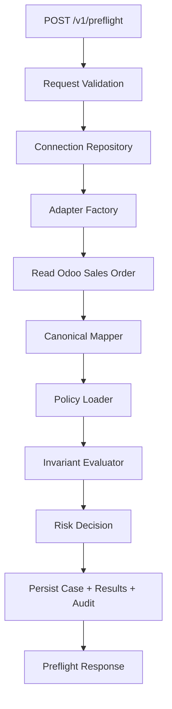

# 01 Architecture Spec

**Parent spec references:** Sections 1, 2, 5, 7, 8, 17, 18, 19, 26, 29, 30.

## Purpose

Define the system architecture for ERPGuard as a semantic safety layer between actors and ERP systems. The MVP focuses on Odoo preflight analysis only: no UI, no LLM execution path, no write execution, and no multi-ERP implementation beyond interface boundaries.

## Architectural Principles

- **Fail closed:** if state, mapping, permissions, or policy evaluation cannot be understood, return `unsupported`, `needs_more_context`, or `block`.
- **Pre-action first:** all value in Phase 1 is before execution.
- **Canonical boundary:** adapters translate native ERP data into canonical objects before policies run.
- **Evidence-based decisions:** each decision must include invariant results, evidence, risk level, and summary.
- **Vendor-neutral interfaces:** Odoo is first, but core code depends on adapter contracts.
- **No free AI execution:** LLM features are out of scope for Phase 1.

## Phase 1 Components

### FastAPI App

Owns HTTP API routing, request validation, response serialization, and error mapping.

### Gateway / Preflight Service

Coordinates the preflight flow:

1. Validate request.
2. Resolve connection.
3. Normalize action.
4. Read native state through adapter interface.
5. Map native state to canonical model.
6. Load applicable policies.
7. Evaluate invariants.
8. Apply risk decision.
9. Persist preflight case, invariant results, and audit event.
10. Return decision contract.

### Canonical Model

Defines stable Pydantic objects for Phase 1:

- `Company`
- `Customer`
- `Product`
- `SalesOrder`
- `SalesOrderLine`

### Adapter Layer

Defines `ERPAdapter` and `OdooAdapter` boundaries. Phase 1 may include a stub or XML-RPC-ready Odoo adapter, but core tests should use fakes.

### Policy System

Loads YAML policies and evaluates deterministic checks against canonical objects and computed context. First real policy: Formula Guard.

### Persistence

Stores:

- connections;
- preflight cases;
- invariant results;
- audit events;
- policies metadata when needed.

SQLite is acceptable for local MVP development, with SQLAlchemy models designed for PostgreSQL compatibility.

## Phase 1 Data Flow

## Explicit Non-Goals

- No approval UI.
- No React/Vite app.
- No LLM provider integration.
- No controlled executor.
- No write calls to Odoo for final business actions.
- No ERPNext adapter implementation.

## Acceptance Criteria

- The backend can start.
- `POST /v1/preflight` accepts the parent spec request shape.
- A fake Odoo adapter can supply a sales order for tests.
- Formula Guard can block invalid formulas with evidence.
- All core components have tests.
